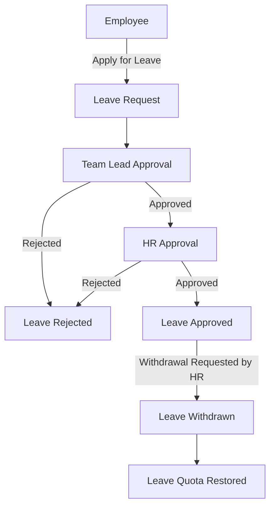

# Employee Leave Management System (EMS) Backend

## Overview
This project is a **Django + Django Rest Framework (DRF) based Employee Management System (EMS)** that manages users, teams, leave allocations, leave requests, and approvals. It implements **role-based access control** and supports features like leave deduction/ restore, withdrawal, and approval history. The system includes REST APIs with JWT authentication and Swagger UI for testing.

---

## Features & Functionality

### User Roles & Permissions
- **HR**
  - Create employees (email must contain `riseuplabs` domain)
  - Allocate monthly leave quotas
  - Approve/reject leave requests (final approval)
  - Withdraw approved leave (restore deducted leave quota)
  - Soft delete employees
  - View all employee and leave records

- **Team Lead**
  - Approve/reject leave requests for team members
  - Cannot approve own leave
  - View own leave requests

- **Employee**
  - Must belong to a team
  - Apply for leave if allocated
  - View own leave balance and history

### Leave Management
- Monthly leave allocation per employee
- Leave request creation with validation:
  - Cannot request past dates
  - Must have sufficient leave balance
  - Start date must be before end date
- Leave approval workflow:
  - Team Lead approves first (if applicable)
  - HR gives final approval
- Leave withdrawal:
  - HR can withdraw HR-approved leaves
  - Leave days are restored automatically
- Approval & withdrawal history stored in `LeaveApproval` table

### Additional Features
- Filtering, pagination, and search for all list endpoints
- Rate limiting / throttling support
- Swagger UI for API testing

---
## 🛠️ Tech Stack
- Django 4.x
- Django REST Framework
- JWT Authentication (djangorestframework-simplejwt)
- Swagger / Redoc API Docs
- Docker & Docker Compose
- SQLite (default) / PostgreSQL (can be configured)

---
## Project Setup
### 1. Without Docker
``` bash
# Clone repo
git clone https://github.com/MehediHasanNasim/Employee-Management-System--EMS-
cd ems_backend

# Create virtual environment
python -m venv venv
source venv/bin/activate  # Linux/Mac
venv\Scripts\activate     # Windows

# Setup .env (use .env.example as reference)
cp .env.example .env      # Linux/Mac
copy .env.example .env    # Windows

# Install dependencies
pip install -r requirements.txt

# Run migrations
python manage.py migrate

# Create superuser
python manage.py createsuperuser

# Run development server
python manage.py runserver
```

### 2. With Docker
``` bash
# Clone repo
git clone https://github.com/MehediHasanNasim/Employee-Management-System--EMS-
cd ems_backend

# Setup with Credential of Django Secret_key & Allowed_host

# Build Docker image
docker-compose build

# Run container
docker-compose up

# Run migrations inside the container
docker-compose exec web python manage.py migrate

# (Optional) Create superuser
docker-compose exec web python manage.py createsuperuser

```
---

## API Endpoints

### Authentication
| Endpoint | Method | Description |
|----------|--------|-------------|
| `/api/auth/token/` | POST | Obtain JWT token |
| `/api/auth/token/refresh/` | POST | Refresh JWT token |

### Users
| Endpoint | Method | Description |
|----------|--------|-------------|
| `/api/users/` | GET, POST | List & create users |
| `/api/users/<id>/` | GET, PUT, DELETE | Retrieve, update, soft delete user |
| `/api/users/roles/` | GET, POST | List & create roles |
| `/api/users/roles/<id>/` | GET, PUT, DELETE | Retrieve, update, delete role |
| `/api/users/teams/` | GET, POST | List & create teams |
| `/api/users/teams/<id>/` | GET, PUT, DELETE | Retrieve, update, delete team |
| `/api/users/teams/<team_id>/users/` | GET | List users of a team |

### Leaves
| Endpoint | Method | Description |
|----------|--------|-------------|
| `/api/leaves/types/` | GET, POST | List & create leave types |
| `/api/leaves/types/<id>/` | GET, PUT, DELETE | Retrieve, update, delete leave type |
| `/api/leaves/allocations/` | GET, POST | List & create leave allocations |
| `/api/leaves/allocations/<id>/` | GET, PUT, DELETE | Retrieve, update, delete allocation |
| `/api/leaves/employees/<employee_id>/allocations/` | GET | List leave allocations for employee |
| `/api/leaves/requests/` | GET, POST | List & create leave requests |
| `/api/leaves/requests/<id>/` | GET, PUT, DELETE | Retrieve, update, delete leave request |
| `/api/leaves/employees/<employee_id>/requests/` | GET | List leave requests for employee |
| `/api/leaves/approvals/` | GET, POST | List & create approvals |
| `/api/leaves/approvals/<id>/` | GET, PUT, DELETE | Retrieve, update, delete approval |
| `/api/leaves/requests/<leave_request_id>/approvals/` | GET | List all approvals of a leave request |
| `/api/leaves/users/<user_id>/given-approvals/` | GET | List approvals made by a user |
| `/api/leaves/requests/<id>/approve/` | POST | Approve leave request (Team Lead / HR) |
| `/api/leaves/requests/<id>/withdraw/` | POST | Withdraw approved leave (HR) |

### Approve Leave Request
**Endpoint:**  
`POST /api/leaves/requests/<id>/approve/`

#### Example Payloads

**For HR**
```json
{
  "approval_type": "hr",
  "decision": "Approved",
  "notes": "Approved by HR"
}
```
**For Team Lead**
```json
{
  "approval_type": "team_lead",
  "decision": "Approved",
  "notes": "Approved by Team Lead"
}
```
### Withdraw Leave Request
**Endpoint:**  
**For HR**
`POST /api/leaves/requests/<id>/withdraw/`
```json
{
  "notes": "Withdrawn due to emergency"
}
```

### Swagger API Testing
- Swagger UI: [http://localhost:8000/swagger/](http://localhost:8000/swagger/)
- Redoc UI: [http://localhost:8000/redoc/](http://localhost:8000/redoc/)

---

## Database Schema


## 📊 Workflow



## 🔮 Future Improvements
- Optional integration of asynchronous tasks (e.g., sending email notifications on leave approval/withdrawal).  
- Additional reporting and analytics features for HR.  


